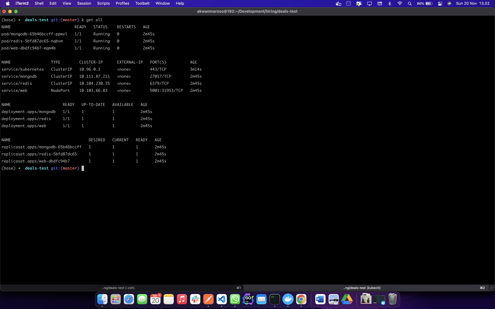

# Users API

Simple RESTFul API for user-api using golang, mongodb, and redis.

## A. Demo

### 1. Deploy App

```shell
    kubectl create -f k8s/
```

### 2. Get All Resource

```shell
    kubectl get all
```



### 3. Running App In Minikube

```shell
    minikube service web
```


### 4. Testing In Postman


## B. Flow Application


